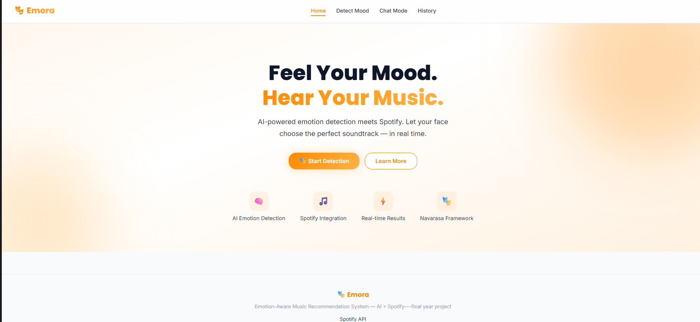
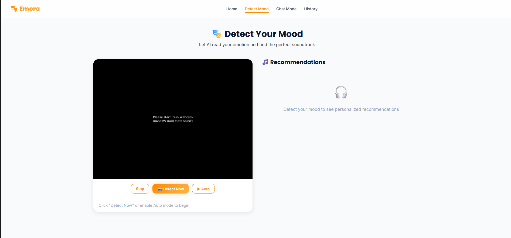
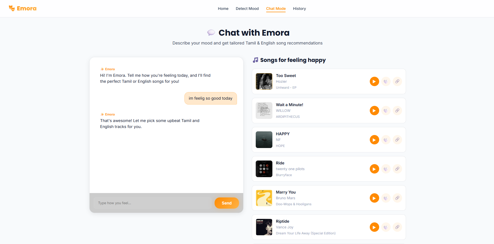
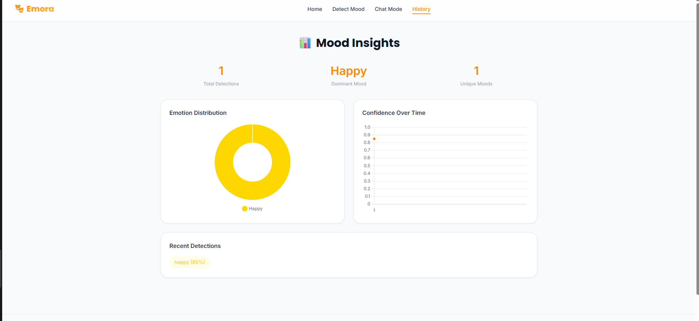

# 🎭 Emotion-Aware Song Recommendation System

> **Bridging Facial Expression Recognition with Modern Music Intelligence**

A full-stack application that uses real-time facial emotion detection to deliver personalized Tamil & English music recommendations. Built with **React + Vite** on the frontend and **Flask + PyTorch** on the backend, powered by the **Spotify API** and an **NVIDIA LLM** for intelligent curation.

---

## 📸 Screenshots

### 🏠 Home Page


### 🎥 Detect Mood — Webcam Emotion Detection


### 💬 Chat with Emora — AI Music Curator


### 📊 Mood Insights — History Dashboard


---

## ✨ Features

| Feature | Description |
|---------|-------------|
| 🎥 **Real-Time Emotion Detection** | Live webcam analysis using a custom CNN trained on AffectNet (29k+ images) |
| 💬 **Chat with Emora** | Conversational AI that understands your mood and picks songs for you |
| 🎵 **Smart Recommendations** | Tamil & English tracks curated via Spotify audio features (valence, energy, danceability) |
| 🧘 **YouTube Therapy Videos** | Automatically suggests stress-relief & meditation content based on detected mood |
| 📊 **Mood Dashboard** | Session-level mood history with emotion distribution stats |
| 🎨 **Premium UI** | Dark-themed glassmorphism design with smooth animations |

---

## 🛠️ Tech Stack

| Layer | Technology |
|-------|------------|
| **Frontend** | React.js, Vite, React Router v6, Vanilla CSS |
| **Backend** | Flask, Flask-CORS, python-dotenv |
| **Deep Learning** | PyTorch, Custom CNN (ResNet-style), OpenCV |
| **AI Curation** | NVIDIA LLM via OpenAI SDK |
| **Music API** | Spotify Web API (Client Credentials) |
| **Data** | Pandas, NumPy, scikit-learn, AffectNet dataset |

---

## 📁 Project Structure

```
Emotion-Aware-Song-Recommendation-System/
│
├── backend/                    # Flask API Server
│   ├── main.py                 # App entry point — creates Flask app, loads model
│   ├── .env.example            # Environment variables template
│   ├── routes/
│   │   ├── api_routes.py       # Core API — /detect-emotion, /recommendations, /chat
│   │   └── auth_routes.py      # Spotify OAuth routes
│   └── services/
│       ├── emotion_service.py  # Loads CNN model, processes webcam frames
│       ├── spotify_service.py  # Spotify API integration & track search
│       └── ai_service.py       # NVIDIA LLM for music parameter generation
│
├── frontend/                   # React Application (Vite)
│   ├── src/
│   │   ├── App.jsx             # Root component with routing
│   │   ├── main.jsx            # React entry point
│   │   ├── index.css           # Global design system & tokens
│   │   ├── components/
│   │   │   ├── DetectPage.jsx  # Webcam emotion detection + recommendations
│   │   │   ├── ChatPage.jsx    # Chat with Emora AI
│   │   │   ├── MoodDashboard.jsx # Mood history & stats
│   │   │   ├── HeroSection.jsx # Landing page hero
│   │   │   ├── Navbar.jsx      # Top navigation bar
│   │   │   ├── Footer.jsx      # Page footer
│   │   │   └── SongCard.jsx    # Individual song card (preview, like, open)
│   │   ├── hooks/
│   │   │   ├── useWebcam.js    # Webcam start/stop/capture
│   │   │   ├── useEmotionDetection.js # Send frame to backend, get emotion
│   │   │   └── useAuth.js      # Auth state management
│   │   └── utils/
│   │       └── api.js          # API client for all backend calls
│   └── vite.config.js          # Build configuration
│
├── models/                     # ML Model Layer
│   ├── custom_cnn.py           # ResNet-style CNN architecture (8 emotions)
│   ├── mobilenet_model.py      # Alternative MobileNet architecture
│   ├── train.py                # Training script (AffectNet dataset)
│   └── checkpoints/            # Saved model weights (.pth files)
│
├── utils/                      # Shared Python Utilities
│   ├── constants.py            # Emotion mappings, colors, display names
│   ├── dataset.py              # Dataset loading & image transforms
│   ├── emotion_history.py      # Mood history tracking
│   └── evaluate.py             # Model evaluation metrics
│
├── data/                       # Data Layer
│   ├── setup_datasets.py       # AffectNet dataset setup script
│   └── songs_cache.parquet     # Cached Spotify tracks dataset
│
├── music/                      # Music Processing
│   ├── preprocess_songs.py     # Song data preprocessing
│   └── recommendations.py     # Recommendation engine logic
│
├── app/                        # Legacy Streamlit App (v1.0)
│   ├── ui.py                   # Old Streamlit UI
│   └── webcam.py               # Old webcam handler
│
├── notebooks/
│   └── comparison.ipynb        # Model comparison notebook
│
├── requirements.txt            # Python dependencies
├── FIXES_SUMMARY.md            # Root cause analysis & bug fixes
└── README.md                   # This file
```

---

## 🚀 Quick Start

### Step 1 — Prerequisites

| Tool | Version | Download |
|------|---------|----------|
| Python | 3.9+ | [python.org](https://www.python.org/downloads/) |
| Node.js | 18+ | [nodejs.org](https://nodejs.org/) |
| Git | Any | [git-scm.com](https://git-scm.com/) |

You'll also need a **Spotify Developer Account** — [create one here](https://developer.spotify.com/dashboard) (free).

### Step 2 — Clone the Repository

```bash
git clone https://github.com/sanjay-m6/Emotion-Aware-Song-Recommendation-System
cd Emotion-Aware-Song-Recommendation-System
```

### Step 3 — Configure Environment Variables

```bash
cd backend
copy .env.example .env        # Windows
# cp .env.example .env        # Mac/Linux
```

Open `backend/.env` in any text editor and fill in your keys:

```env
# ── Required ──
# Get these from https://developer.spotify.com/dashboard → Create App
SPOTIFY_CLIENT_ID=paste_your_client_id
SPOTIFY_CLIENT_SECRET=paste_your_client_secret
SPOTIFY_REDIRECT_URI=http://localhost:5000/api/auth/callback

# ── Optional ──
# Enables AI-powered music curation (get from https://build.nvidia.com)
NVIDIA_API_KEY=paste_your_nvidia_key

# ── Server Config (leave as defaults) ──
FLASK_SECRET_KEY=change-this-to-a-random-string
FLASK_ENV=development
FLASK_PORT=5000
FRONTEND_URL=http://localhost:5173
```

### Step 4 — Install & Run Backend

```bash
# From the project root folder:

python -m venv venv
venv\Scripts\activate          # Windows
# source venv/bin/activate     # Mac/Linux

pip install -r requirements.txt

python backend/main.py
```

✅ You should see: `[OK] Flask backend ready` — the server runs on **http://localhost:5000**

### Step 5 — Install & Run Frontend

Open a **new terminal** (keep the backend running):

```bash
cd frontend
npm install
npm run dev
```

✅ The app opens at **http://localhost:5173**

### Step 6 — You're Done! 🎉

| Service | URL |
|---------|-----|
| Frontend (UI) | [http://localhost:5173](http://localhost:5173) |
| Backend (API) | [http://localhost:5000](http://localhost:5000) |
| Health Check | [http://localhost:5000/api/health](http://localhost:5000/api/health) |

> **Tip:** Both terminals must stay open. The backend serves the AI & Spotify APIs, and the frontend is the UI you interact with.

---

## ⚡ One-Command Startup

After completing the initial setup once, start the entire app with a single command:

**Windows (PowerShell):**
```powershell
Start-Process powershell -ArgumentList "-NoExit", "-Command", "cd 'c:\Users\sanja\Emotion-Aware-Song-Recommendation-System'; python backend/main.py" ; cd frontend; npm run dev
```

**Mac / Linux:**
```bash
python backend/main.py & cd frontend && npm run dev
```

---

## 🎵 How It Works

```
┌──────────────┐     base64 frame     ┌──────────────────┐     Spotify API     ┌────────────┐
│   React UI   │ ──────────────────▶  │   Flask Backend   │ ────────────────▶  │  Spotify   │
│  (Webcam)    │                      │                    │                    │  Web API   │
└──────────────┘  ◀──────────────────  │  ┌──────────────┐ │  ◀────────────────  └────────────┘
                   emotion + tracks   │  │  Custom CNN   │ │    track results
                                      │  │  (PyTorch)    │ │
                                      │  └──────────────┘ │
                                      │  ┌──────────────┐ │
                                      │  │  NVIDIA LLM   │ │
                                      │  │  (AI Curator) │ │
                                      │  └──────────────┘ │
                                      └──────────────────┘
```

1. **Face Capture** — The React frontend captures webcam frames and sends them as base64 to the backend.
2. **Emotion Detection** — The Custom CNN processes the image, detecting one of 8 emotions: `Happy`, `Sad`, `Anger`, `Fear`, `Surprise`, `Disgust`, `Contempt`, `Neutral`.
3. **AI Curation** — The NVIDIA LLM analyzes the emotion + confidence to generate optimal Spotify audio feature targets.
4. **Track Search** — The Spotify API returns high-popularity Tamil & English tracks matching the emotional profile.
5. **YouTube Therapy** — For negative emotions, therapeutic meditation/stress-relief videos are recommended alongside music.

---

## 🔌 API Reference

| Method | Endpoint | Description |
|--------|----------|-------------|
| `POST` | `/api/detect-emotion` | Detect emotion from base64 webcam frame |
| `GET` | `/api/recommendations` | Get Spotify tracks for an emotion |
| `POST` | `/api/chat` | Chat with Emora AI for music recommendations |
| `GET` | `/api/mood-history` | Get session mood history & stats |
| `GET` | `/api/health` | Server health check |

---

## 2. Load & Cache Datasets

```bash
# Download AffectNet & Spotify datasets, verify integrity, cache Spotify
python data/setup_datasets.py
python music/preprocess_songs.py

# Expected output:
# ✅ Dataset 1 (AffectNet) loaded successfully - 29,042 samples
# ✅ Dataset 2 (Spotify) loaded successfully - 100,000+ tracks cached
```

## 3. Train Models

```bash
# Train CustomCNN (60 epochs, batch size 64)
python models/train.py --model custom_cnn --epochs 60 --batch_size 64

# Train MobileNetV2 (60 epochs, batch size 32)
python models/train.py --model mobilenet --epochs 60 --batch_size 32

# Expected output:
# ✅ Training complete!
#   Best Val Accuracy: 0.7234
#   Best Epoch: 42
#   Checkpoint: models/checkpoints/mobilenet_best.pth
```

## 4. Evaluate & Compare Models

Open and run the Jupyter notebook:

```bash
jupyter notebook notebooks/comparison.ipynb
```

This notebook will:

* Load both trained models
* Plot training curves (loss, accuracy)
* Display confusion matrices for each emotion
* Print classification reports highlighting contempt F1
* Benchmark inference speed and model size
* Provide deployment recommendation

---

## 📄 Project Documentation

For detailed project reports, architecture diagrams, and academic documentation:

📎 **[View Full Project Details on Notion](https://www.notion.so/Emotion-Aware-Music-Recommendation-System-34a5e0abfd9d80938a99de2ba591e0d2?source=copy_link)**

---

## ⚖️ License & Citation

This project is licensed under the [MIT License](LICENSE).

It utilizes the following resources for educational purposes:
- **AffectNet**: Mollahosseini et al. (2019)
- **Spotify Tracks Dataset**: [maharshipandya/spotify-tracks-dataset](https://huggingface.co/datasets/maharshipandya/spotify-tracks-dataset)

---

<p align="center">
  Built with ❤️ to create a more empathetic music listening experience through technology. 🎵
</p>
